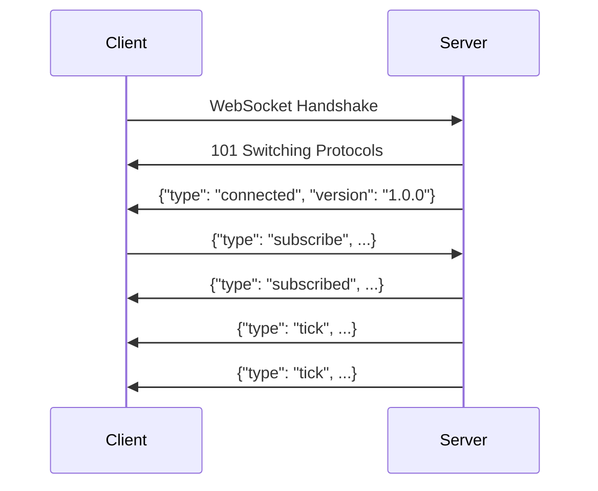

# IB Stream WebSocket API Specification

## Overview

This document specifies the WebSocket transport protocol for IB Stream API Server, providing an alternative to Server-Sent Events (SSE) for real-time market data streaming. The WebSocket implementation offers bidirectional communication, better client library support, and enhanced control over streaming sessions.

## Architecture

### WebSocket vs SSE Comparison

| Feature | SSE | WebSocket |
|---------|-----|-----------|
| Communication | Unidirectional (server → client) | Bidirectional |
| Protocol | HTTP/1.1 | WebSocket (RFC 6455) |
| Client Control | Limited (HTTP request only) | Full (subscribe/unsubscribe) |
| Reconnection | Client-managed | Built-in support |
| Message Types | Text only | Text/Binary |
| Browser Support | Good | Excellent |
| Library Support | Limited | Extensive |

### Integration Architecture

```
┌─────────────────┐         ┌─────────────────┐
│   WebSocket     │         │      SSE        │
│    Clients      │         │    Clients      │
└────────┬────────┘         └────────┬────────┘
         │ WebSocket                 │ HTTP/SSE
         ▼                           ▼
┌─────────────────────────────────────────────┐
│            FastAPI Server                   │
├─────────────────────┬───────────────────────┤
│  WebSocket Manager  │   SSE Response        │
│  (ws_manager.py)    │   (sse_response.py)   │
└─────────────────────┴───────────────────────┘
                      │
                      ▼
         ┌─────────────────────────┐
         │    StreamManager        │
         │  (Shared Infrastructure)│
         └─────────────────────────┘
                      │
                      ▼
         ┌─────────────────────────┐
         │    StreamingApp         │
         │    (TWS Connection)     │
         └─────────────────────────┘
```

## WebSocket Endpoints

### 1. Single Stream Endpoint
```
ws://[host]:[port]/ws/stream/{contract_id}/{tick_type}
```

**Path Parameters:**
- `contract_id` (integer): IB contract identifier
- `tick_type` (string): One of `Last`, `AllLast`, `BidAsk`, `MidPoint`

**Query Parameters:**
- `limit` (integer, optional): Maximum number of ticks before auto-stop (1-10000)
- `timeout` (integer, optional): Stream timeout in seconds (5-3600)

**Example:**
```
ws://localhost:8001/ws/stream/711280073/BidAsk?limit=100&timeout=60
```

### 2. Multi-Stream Endpoint
```
ws://[host]:[port]/ws/stream/{contract_id}/multi
```

**Path Parameters:**
- `contract_id` (integer): IB contract identifier

**Description:** Allows subscription to multiple tick types for the same contract through a single WebSocket connection.

### 3. Control Channel Endpoint
```
ws://[host]:[port]/ws/control
```

**Description:** Management endpoint for monitoring active streams, server health, and administrative operations.

## Message Protocol

### Client-to-Server Messages

#### 1. Subscribe Message
```json
{
  "type": "subscribe",
  "id": "msg-001",
  "data": {
    "contract_id": 711280073,
    "tick_type": "BidAsk",
    "params": {
      "limit": 100,
      "timeout": 60
    }
  }
}
```

#### 2. Multi-Subscribe Message
```json
{
  "type": "multi_subscribe",
  "id": "msg-002",
  "data": {
    "contract_id": 711280073,
    "tick_types": ["BidAsk", "Last"],
    "params": {
      "timeout": 300
    }
  }
}
```

#### 3. Unsubscribe Message
```json
{
  "type": "unsubscribe",
  "id": "msg-003",
  "data": {
    "request_id": "req-12345"
  }
}
```

#### 4. Unsubscribe All Message
```json
{
  "type": "unsubscribe_all",
  "id": "msg-004"
}
```

#### 5. Ping Message
```json
{
  "type": "ping",
  "id": "msg-005",
  "timestamp": "2025-07-09T12:00:00Z"
}
```

### Server-to-Client Messages

#### 1. Subscribed Confirmation
```json
{
  "type": "subscribed",
  "id": "msg-001",
  "data": {
    "request_id": "req-12345",
    "contract_id": 711280073,
    "tick_type": "BidAsk",
    "contract_info": {
      "symbol": "MNQ",
      "exchange": "CME",
      "currency": "USD"
    }
  },
  "timestamp": "2025-07-09T12:00:00Z"
}
```

#### 2. Tick Data Message
```json
{
  "type": "tick",
  "request_id": "req-12345",
  "data": {
    "contract_id": 711280073,
    "tick_type": "BidAsk",
    "bid_price": 20150.25,
    "bid_size": 5,
    "ask_price": 20150.50,
    "ask_size": 3,
    "time": "2025-07-09T12:00:01.123456Z"
  },
  "timestamp": "2025-07-09T12:00:01.150Z"
}
```

#### 3. Error Message
```json
{
  "type": "error",
  "request_id": "req-12345",
  "error": {
    "code": "RATE_LIMIT_EXCEEDED",
    "message": "Maximum concurrent streams exceeded",
    "details": {
      "max_streams": 10,
      "current_streams": 10
    }
  },
  "timestamp": "2025-07-09T12:00:00Z"
}
```

#### 4. Stream Complete Message
```json
{
  "type": "complete",
  "request_id": "req-12345",
  "data": {
    "reason": "limit_reached",
    "total_ticks": 100,
    "duration_seconds": 45.2
  },
  "timestamp": "2025-07-09T12:00:45Z"
}
```

#### 5. Unsubscribed Confirmation
```json
{
  "type": "unsubscribed",
  "id": "msg-003",
  "data": {
    "request_id": "req-12345"
  },
  "timestamp": "2025-07-09T12:00:00Z"
}
```

#### 6. Pong Message
```json
{
  "type": "pong",
  "id": "msg-005",
  "data": {
    "client_timestamp": "2025-07-09T12:00:00Z",
    "server_timestamp": "2025-07-09T12:00:00.050Z"
  }
}
```

## Connection Lifecycle

### 1. Connection Establishment



### 2. Error Handling

The WebSocket protocol defines standard close codes:
- `1000`: Normal closure
- `1001`: Going away (server shutdown)
- `1003`: Unsupported data
- `1008`: Policy violation (rate limit)
- `1011`: Internal server error
- `4000`: Invalid message format
- `4001`: Authentication required
- `4002`: Invalid contract
- `4003`: TWS connection lost

### 3. Reconnection Strategy

```javascript
class WebSocketClient {
  constructor(url) {
    this.url = url;
    this.reconnectDelay = 1000;
    this.maxReconnectDelay = 30000;
    this.reconnectDecay = 1.5;
  }

  connect() {
    this.ws = new WebSocket(this.url);
    
    this.ws.onclose = (event) => {
      if (!event.wasClean) {
        setTimeout(() => {
          this.reconnectDelay = Math.min(
            this.reconnectDelay * this.reconnectDecay,
            this.maxReconnectDelay
          );
          this.connect();
        }, this.reconnectDelay);
      }
    };
  }
}
```

## Implementation Details

### Request ID Management

Each subscription generates a unique request ID:
```python
def generate_request_id(contract_id: int, tick_type: str) -> str:
    timestamp = int(time.time() * 1000)
    random_suffix = random.randint(1000, 9999)
    return f"{contract_id}_{tick_type}_{timestamp}_{random_suffix}"
```

### Message Validation

All incoming messages are validated against JSON schemas:
```python
SUBSCRIBE_SCHEMA = {
    "type": "object",
    "properties": {
        "type": {"const": "subscribe"},
        "id": {"type": "string"},
        "data": {
            "type": "object",
            "properties": {
                "contract_id": {"type": "integer"},
                "tick_type": {"enum": ["Last", "AllLast", "BidAsk", "MidPoint"]},
                "params": {
                    "type": "object",
                    "properties": {
                        "limit": {"type": "integer", "minimum": 1, "maximum": 10000},
                        "timeout": {"type": "integer", "minimum": 5, "maximum": 3600}
                    }
                }
            },
            "required": ["contract_id", "tick_type"]
        }
    },
    "required": ["type", "id", "data"]
}
```

### Rate Limiting

WebSocket connections are subject to:
- Maximum concurrent connections per IP: 10
- Maximum subscriptions per connection: 20
- Maximum messages per second: 100
- Maximum bandwidth per connection: 10 MB/s

## Client Examples

### JavaScript/TypeScript Client

```typescript
interface IbStreamWebSocket {
  connect(): Promise<void>;
  subscribe(contractId: number, tickType: string, params?: any): Promise<string>;
  unsubscribe(requestId: string): Promise<void>;
  disconnect(): void;
}

class IbStreamClient implements IbStreamWebSocket {
  private ws: WebSocket | null = null;
  private messageId = 0;
  private pendingMessages = new Map<string, {resolve: Function, reject: Function}>();
  private subscriptions = new Map<string, (data: any) => void>();

  constructor(private url: string) {}

  async connect(): Promise<void> {
    return new Promise((resolve, reject) => {
      this.ws = new WebSocket(this.url);
      
      this.ws.onopen = () => resolve();
      this.ws.onerror = (error) => reject(error);
      this.ws.onmessage = (event) => this.handleMessage(JSON.parse(event.data));
    });
  }

  async subscribe(
    contractId: number, 
    tickType: string, 
    params?: any,
    onTick?: (data: any) => void
  ): Promise<string> {
    const msgId = `msg-${++this.messageId}`;
    
    return new Promise((resolve, reject) => {
      this.pendingMessages.set(msgId, { resolve, reject });
      
      this.ws?.send(JSON.stringify({
        type: "subscribe",
        id: msgId,
        data: { contract_id: contractId, tick_type: tickType, params }
      }));
    });
  }

  private handleMessage(message: any) {
    switch (message.type) {
      case "subscribed":
        const pending = this.pendingMessages.get(message.id);
        if (pending) {
          pending.resolve(message.data.request_id);
          this.pendingMessages.delete(message.id);
        }
        break;
        
      case "tick":
        const handler = this.subscriptions.get(message.request_id);
        if (handler) handler(message.data);
        break;
        
      case "error":
        console.error("Stream error:", message.error);
        break;
    }
  }
}
```

### Python Client Example

```python
import asyncio
import json
import websockets
from typing import Dict, Callable, Optional

class IbStreamWebSocket:
    def __init__(self, url: str):
        self.url = url
        self.ws: Optional[websockets.WebSocketClientProtocol] = None
        self.message_id = 0
        self.pending_messages: Dict[str, asyncio.Future] = {}
        self.subscriptions: Dict[str, Callable] = {}
        
    async def connect(self):
        self.ws = await websockets.connect(self.url)
        asyncio.create_task(self._message_handler())
        
    async def subscribe(self, contract_id: int, tick_type: str, 
                       params: dict = None, on_tick: Callable = None) -> str:
        msg_id = f"msg-{self.message_id}"
        self.message_id += 1
        
        future = asyncio.Future()
        self.pending_messages[msg_id] = future
        
        await self.ws.send(json.dumps({
            "type": "subscribe",
            "id": msg_id,
            "data": {
                "contract_id": contract_id,
                "tick_type": tick_type,
                "params": params or {}
            }
        }))
        
        request_id = await future
        if on_tick:
            self.subscriptions[request_id] = on_tick
        return request_id
        
    async def _message_handler(self):
        async for message in self.ws:
            data = json.loads(message)
            
            if data["type"] == "subscribed":
                future = self.pending_messages.pop(data["id"], None)
                if future:
                    future.set_result(data["data"]["request_id"])
                    
            elif data["type"] == "tick":
                handler = self.subscriptions.get(data["request_id"])
                if handler:
                    await handler(data["data"])
```

## Migration Guide

### Moving from SSE to WebSocket

1. **URL Pattern Change**:
   - SSE: `http://host:port/stream/{contract_id}/{tick_type}`
   - WebSocket: `ws://host:port/ws/stream/{contract_id}/{tick_type}`

2. **Client Library Change**:
   - Replace SSE client with WebSocket client
   - Implement message-based protocol instead of event stream

3. **Error Handling**:
   - WebSocket provides structured error messages
   - Built-in reconnection with close codes

4. **Feature Enhancements**:
   - Dynamic subscription management
   - Bidirectional communication
   - Better connection state tracking

### Performance Considerations

| Metric | SSE | WebSocket |
|--------|-----|-----------|
| Latency | ~1-5ms | ~0.5-2ms |
| Overhead | HTTP headers per request | Minimal after handshake |
| Throughput | Limited by HTTP/1.1 | Higher (binary frames) |
| CPU Usage | Higher (text parsing) | Lower (binary protocol) |
| Memory | One connection per stream | Multiplexed streams |

## Security Considerations

1. **Authentication**: 
   - Optional JWT token in connection query string
   - API key validation during handshake

2. **Authorization**:
   - Contract-level permissions
   - Rate limiting per authenticated user

3. **Encryption**:
   - Use `wss://` for TLS encryption
   - Certificate validation required

4. **Input Validation**:
   - All messages validated against schemas
   - Injection attack prevention

## Future Enhancements

1. **Binary Protocol**: 
   - MessagePack or Protocol Buffers for efficiency
   - Reduced bandwidth usage

2. **Compression**:
   - Per-message deflate extension
   - Configurable compression levels

3. **Advanced Features**:
   - Snapshot + updates pattern
   - Delta compression for tick data
   - Market depth (Level 2) streaming
   - Historical data replay

## Appendix: Error Codes

| Code | Name | Description |
|------|------|-------------|
| `CONNECTION_ERROR` | TWS Connection Error | Cannot connect to TWS/Gateway |
| `CONTRACT_NOT_FOUND` | Invalid Contract | Contract ID not found |
| `RATE_LIMIT_EXCEEDED` | Rate Limit | Too many streams or messages |
| `INVALID_TICK_TYPE` | Invalid Tick Type | Unsupported tick type |
| `STREAM_TIMEOUT` | Timeout | Stream exceeded timeout |
| `INVALID_MESSAGE` | Protocol Error | Malformed message |
| `AUTH_REQUIRED` | Authentication Required | Missing or invalid credentials |
| `INTERNAL_ERROR` | Server Error | Unexpected server error |